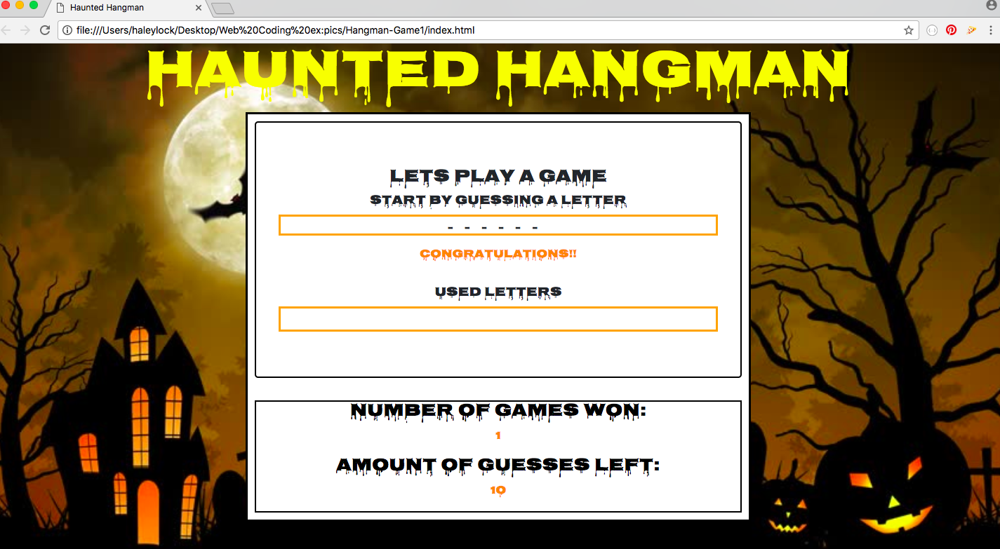
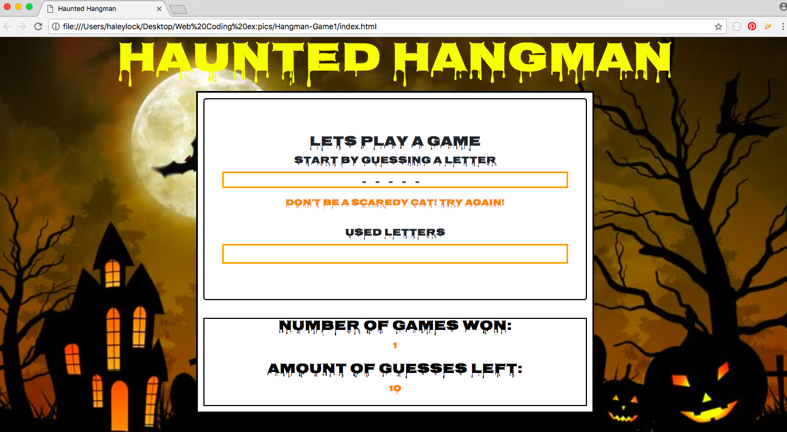

# Hangman-Game1
A haunted hangman game using javascript.

## Description:

1) The game selects a random word from a word list and makes that the secret word
2) The player guesses one letter at a time, trying to figure out what the word is
3) If the player guesses correctly, any instances of that letter are revealed in the secret word
4) If the player guesses incorrectly, they are penalized by taking away a guess
5) If a player reveals all of the letters of the secret word, they win
6) If a player makes 10 incorrect guesses before solving the secret word, they lose

## Image Demo
#### Game Won

#### Game Lost 

